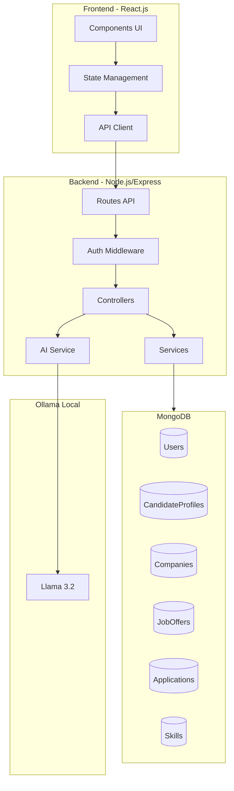
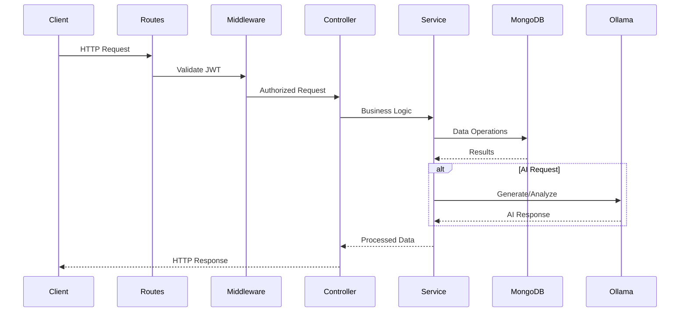
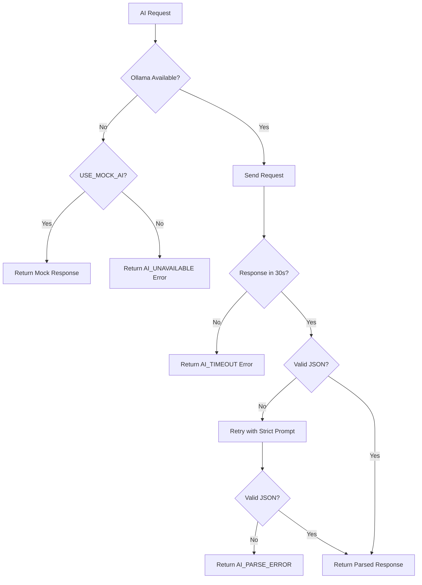

# Design Document: CareerPath AI

## Overview

CareerPath AI est une plateforme de recrutement full-stack MERN intégrant une IA locale via Ollama/Llama 3.2. L'architecture suit le pattern MVC avec séparation claire entre API REST, services métier, et couche d'accès aux données MongoDB.

### Objectifs Clés
- Authentification JWT avec gestion des rôles (candidate, recruiter, admin)
- CRUD complet pour profils, entreprises, offres et candidatures
- Intégration IA locale pour génération de lettres et scoring de compatibilité
- Mode fallback pour démonstrations sans dépendance Ollama

## Architecture




### Flux de Données



## Components and Interfaces

### Backend Structure

```
backend/
├── src/
│   ├── config/
│   │   ├── database.js      # MongoDB connection
│   │   ├── email.js         # Email config (SMTP)
│   │   ├── ollama.js        # Ollama client config
│   │   └── constants.js     # App constants
│   ├── middleware/
│   │   ├── auth.js          # JWT verification
│   │   ├── roleGuard.js     # Role-based access
│   │   └── upload.js        # File upload (multer)
│   ├── models/
│   │   ├── User.js
│   │   ├── CandidateProfile.js
│   │   ├── Company.js
│   │   ├── JobOffer.js
│   │   ├── Application.js
│   │   └── Skill.js
│   ├── controllers/
│   │   ├── authController.js
│   │   ├── profileController.js
│   │   ├── companyController.js
│   │   ├── jobController.js
│   │   ├── applicationController.js
│   │   ├── skillController.js
│   │   └── aiController.js
│   ├── services/
│   │   ├── authService.js
│   │   ├── emailService.js    # Email sending (nodemailer)
│   │   ├── profileService.js
│   │   ├── companyService.js
│   │   ├── jobService.js
│   │   ├── applicationService.js
│   │   ├── skillService.js
│   │   └── aiService.js
│   ├── routes/
│   │   ├── auth.js
│   │   ├── profile.js
│   │   ├── company.js
│   │   ├── jobs.js
│   │   ├── applications.js
│   │   ├── skills.js
│   │   └── ai.js
│   ├── utils/
│   │   ├── pdfParser.js     # PDF text extraction
│   │   ├── otpUtils.js      # OTP generation and hashing
│   │   ├── validators.js    # Input validation
│   │   └── errors.js        # Custom error classes
│   └── app.js
├── tests/
│   ├── unit/
│   ├── integration/
│   └── properties/
└── package.json
```


### API Endpoints

| Method | Endpoint | Description | Auth | Role |
|--------|----------|-------------|------|------|
| POST | /api/auth/register | User registration (sends OTP) | No | - |
| POST | /api/auth/verify-otp | Verify email with OTP code | No | - |
| POST | /api/auth/resend-otp | Resend OTP code | No | - |
| POST | /api/auth/login | User login (verified only) | No | - |
| GET | /api/profile | Get candidate profile | Yes | candidate |
| PUT | /api/profile | Update candidate profile | Yes | candidate |
| POST | /api/profile/cv | Upload CV PDF | Yes | candidate |
| GET | /api/companies | List companies | Yes | any |
| POST | /api/companies | Create company | Yes | recruiter |
| PUT | /api/companies/:id | Update company | Yes | recruiter |
| GET | /api/jobs | Search job offers | Yes | any |
| POST | /api/jobs | Create job offer | Yes | recruiter |
| PUT | /api/jobs/:id | Update job offer | Yes | recruiter |
| DELETE | /api/jobs/:id | Delete job offer | Yes | recruiter |
| GET | /api/wishlist | Get wishlist | Yes | candidate |
| POST | /api/wishlist/:jobId | Add to wishlist | Yes | candidate |
| DELETE | /api/wishlist/:jobId | Remove from wishlist | Yes | candidate |
| GET | /api/applications | List applications | Yes | any |
| POST | /api/applications | Submit application | Yes | candidate |
| PUT | /api/applications/:id/status | Update status | Yes | recruiter |
| POST | /api/ai/generate-cover-letter | Generate cover letter | Yes | candidate |
| POST | /api/ai/analyze-match | Analyze compatibility | Yes | recruiter |
| GET | /api/skills | List all skills | Yes | any |
| POST | /api/skills | Create skill | Yes | admin |
| DELETE | /api/skills/:id | Delete skill | Yes | admin |
| GET | /api/admin/users | List all users | Yes | admin |
| DELETE | /api/admin/users/:id | Delete user | Yes | admin |

### Service Interfaces

```typescript
// authService.ts
interface AuthService {
  register(email: string, password: string, role: Role): Promise<{ user: User, message: string }>;
  verifyOTP(email: string, otpCode: string): Promise<{ user: User, token: string }>;
  resendOTP(email: string): Promise<{ message: string }>;
  login(email: string, password: string): Promise<{ user: User, token: string }>;
  verifyToken(token: string): Promise<User>;
}

// emailService.ts
interface EmailService {
  sendOTP(email: string, otpCode: string): Promise<void>;
}

// OTP utilities
interface OTPUtils {
  generateOTP(): string;  // Returns 6-digit code
  hashOTP(otp: string): string;
  verifyOTP(otp: string, hash: string): boolean;
}

// aiService.ts
interface AIService {
  generateCoverLetter(candidate: CandidateProfile, job: JobOffer): Promise<string>;
  analyzeMatch(candidate: CandidateProfile, job: JobOffer): Promise<{ score: number, justification: string }>;
  isAvailable(): Promise<boolean>;
}

// Ollama Request/Response
interface OllamaRequest {
  model: string;
  messages: Array<{ role: 'system' | 'user', content: string }>;
  stream: boolean;
}

interface OllamaResponse {
  message: { content: string };
  done: boolean;
}
```


## Data Models

### User Schema
```javascript
{
  email: { type: String, unique: true, required: true },
  password: { type: String, required: true }, // bcrypt hashed
  role: { type: String, enum: ['candidate', 'recruiter', 'admin'], required: true },
  isVerified: { type: Boolean, default: false },
  otp: {
    code: String,           // bcrypt hashed OTP
    expiresAt: Date         // 10 minutes from generation
  },
  wishlist: [{ type: ObjectId, ref: 'JobOffer' }],
  createdAt: { type: Date, default: Date.now }
}
```

### CandidateProfile Schema
```javascript
{
  user: { type: ObjectId, ref: 'User', unique: true, required: true },
  firstName: String,
  lastName: String,
  bio: String,
  phone: String,
  portfolioLink: String,
  cvUrl: String,        // Path to stored PDF
  cvText: String        // Extracted text from PDF
}
```

### Company Schema
```javascript
{
  name: { type: String, required: true },
  description: String,
  logo: String,
  website: String,
  location: String,
  owner: { type: ObjectId, ref: 'User', required: true }
}
```

### JobOffer Schema
```javascript
{
  title: { type: String, required: true },
  description: { type: String, required: true },
  salary: String,
  contractType: { type: String, enum: ['CDI', 'CDD', 'Freelance', 'Stage'] },
  deadline: Date,
  company: { type: ObjectId, ref: 'Company', required: true },
  skills: [{ type: ObjectId, ref: 'Skill' }],
  createdAt: { type: Date, default: Date.now }
}
```

### Application Schema
```javascript
{
  job: { type: ObjectId, ref: 'JobOffer', required: true },
  candidate: { type: ObjectId, ref: 'User', required: true },
  status: { type: String, enum: ['pending', 'accepted', 'rejected', 'interview'], default: 'pending' },
  coverLetter: String,
  aiGeneratedContent: String,
  matchScore: Number,           // 0-100
  matchJustification: String,
  appliedAt: { type: Date, default: Date.now }
}
// Compound index: { job: 1, candidate: 1 } unique
```

### Skill Schema
```javascript
{
  name: { type: String, unique: true, required: true }
}
```


## Correctness Properties

*A property is a characteristic or behavior that should hold true across all valid executions of a system-essentially, a formal statement about what the system should do. Properties serve as the bridge between human-readable specifications and machine-verifiable correctness guarantees.*

### Property 1: Authentication Round-Trip with OTP
*For any* valid registration data (email, password, role), registering then verifying with correct OTP then logging in with the same credentials should return a valid JWT token that decodes to the same user ID.
**Validates: Requirements 1.1, 1.2, 1b.2**

### Property 1b: OTP Expiration Enforcement
*For any* OTP code, if verification is attempted after the 10-minute expiration window, the verification should be rejected regardless of code correctness.
**Validates: Requirements 1b.1, 1b.3**

### Property 1c: OTP Hash Security
*For any* generated OTP code, the stored hash should not be reversible to the original code, and only the correct code should verify against the hash.
**Validates: Requirements 1b.5, 1b.6**

### Property 2: Authorization Enforcement
*For any* protected endpoint and any user, if the user's role does not match the endpoint's required role, the request should be rejected with 403 status; if no valid token is provided, the request should be rejected with 401 status.
**Validates: Requirements 1.4, 1.5**

### Property 3: Profile Data Integrity
*For any* candidate profile update with partial data, the unchanged fields should retain their original values after the update operation.
**Validates: Requirements 2.1, 3.2, 4.2**

### Property 4: PDF Text Extraction Round-Trip
*For any* PDF file containing text, uploading the file and retrieving the extracted text should preserve the original text content (modulo whitespace normalization).
**Validates: Requirements 2.2, 2.5**

### Property 5: Cascade Deletion Consistency
*For any* recruiter deletion, the associated Company, all JobOffers of that company, and all Applications on those offers should be removed; for any candidate deletion, the CandidateProfile and all Applications by that candidate should be removed; for any JobOffer deletion, all associated Applications should be removed.
**Validates: Requirements 4.3, 10.2, 10.3, 10.4**

### Property 5b: Deletion Notification
*For any* job offer or recruiter deletion that affects candidate applications, notification emails should be sent to all affected candidates.
**Validates: Requirements 10.5**

### Property 6: Skill Filter Correctness
*For any* job search with skill filter, all returned JobOffers should contain the specified skill ID in their skills array.
**Validates: Requirements 4.4**

### Property 7: Deadline Exclusion
*For any* job search by a candidate, no JobOffer with a deadline in the past should appear in the results.
**Validates: Requirements 4.5**

### Property 8: Search Results Ordering
*For any* job search query, the returned JobOffers should be sorted by createdAt in descending order (newest first).
**Validates: Requirements 5.1**

### Property 9: Wishlist Idempotence
*For any* candidate and JobOffer, adding the same job to wishlist multiple times should result in exactly one entry; removing a job should result in zero entries.
**Validates: Requirements 5.2, 5.3**

### Property 10: Application Status Preservation
*For any* application status update, only the status field should change; all other fields (coverLetter, appliedAt, etc.) should remain unchanged.
**Validates: Requirements 6.3**

### Property 11: AI Cover Letter Word Limit
*For any* AI-generated cover letter, the word count should be less than or equal to 250 words.
**Validates: Requirements 7.3**

### Property 12: Ollama Request Serialization
*For any* AI request (cover letter or match analysis), the serialized request should be valid JSON containing 'model', 'messages' array with 'system' and 'user' roles.
**Validates: Requirements 7.5, 8.5**

### Property 13: Match Score Bounds
*For any* match analysis response, the score should be a number between 0 and 100 inclusive, and justification should be a non-empty string.
**Validates: Requirements 8.1, 8.6**

### Property 14: Skills Alphabetical Ordering
*For any* skills list request, the returned skills should be sorted alphabetically by name (case-insensitive).
**Validates: Requirements 9.4**

### Property 15: Password Exclusion
*For any* user list or user detail response, the password field should never be present in the returned data.
**Validates: Requirements 10.1**

### Property 16: Mock AI Determinism
*For any* AI request when USE_MOCK_AI is true, the response should be returned immediately (< 100ms) with predefined mock content.
**Validates: Requirements 11.4**


## Error Handling

### Error Response Format
```javascript
{
  success: false,
  error: {
    code: string,      // e.g., 'AUTH_INVALID_TOKEN'
    message: string,   // Human-readable message
    details?: any      // Optional additional info
  }
}
```

### Error Codes
| Code | HTTP Status | Description |
|------|-------------|-------------|
| AUTH_INVALID_CREDENTIALS | 401 | Invalid email or password |
| AUTH_EMAIL_NOT_VERIFIED | 401 | Email not verified, OTP required |
| AUTH_INVALID_OTP | 400 | Invalid or expired OTP code |
| AUTH_OTP_EXPIRED | 400 | OTP code has expired |
| AUTH_INVALID_TOKEN | 401 | Missing or invalid JWT |
| AUTH_FORBIDDEN | 403 | Insufficient permissions |
| VALIDATION_ERROR | 400 | Invalid input data |
| DUPLICATE_EMAIL | 409 | Email already registered |
| DUPLICATE_APPLICATION | 409 | Already applied to this job |
| DUPLICATE_SKILL | 409 | Skill name already exists |
| NOT_FOUND | 404 | Resource not found |
| AI_UNAVAILABLE | 503 | Ollama service unavailable |
| AI_TIMEOUT | 504 | AI request exceeded 30s |
| AI_PARSE_ERROR | 500 | Failed to parse AI response |
| FILE_INVALID_TYPE | 400 | Invalid file type (PDF required) |

### AI Error Handling Strategy



## Testing Strategy

### Testing Framework
- **Unit Tests**: Jest
- **Property-Based Tests**: fast-check (JavaScript PBT library)
- **Integration Tests**: Supertest + MongoDB Memory Server

### Dual Testing Approach

#### Unit Tests
Unit tests verify specific examples and edge cases:
- Authentication flow with valid/invalid credentials
- Role-based access control for each endpoint
- PDF parsing with sample documents
- AI prompt formatting
- Error handling scenarios

#### Property-Based Tests
Property tests verify universal properties across generated inputs. Each property test:
- Runs minimum 100 iterations
- Uses smart generators constrained to valid input space
- Is tagged with the correctness property it validates

### Test File Organization
```
tests/
├── unit/
│   ├── auth.test.js
│   ├── profile.test.js
│   ├── company.test.js
│   ├── job.test.js
│   ├── application.test.js
│   ├── skill.test.js
│   └── ai.test.js
├── properties/
│   ├── auth.property.test.js      # Properties 1, 2
│   ├── profile.property.test.js   # Properties 3, 4
│   ├── job.property.test.js       # Properties 5, 6, 7, 8
│   ├── wishlist.property.test.js  # Property 9
│   ├── application.property.test.js # Property 10
│   ├── ai.property.test.js        # Properties 11, 12, 13, 16
│   └── skill.property.test.js     # Properties 14, 15
└── integration/
    ├── auth.integration.test.js
    ├── candidate-flow.integration.test.js
    └── recruiter-flow.integration.test.js
```

### Property Test Annotation Format
Each property-based test must include:
```javascript
/**
 * Feature: careerpath-ai, Property 1: Authentication Round-Trip
 * Validates: Requirements 1.1, 1.2
 */
test.prop([validEmailArb, validPasswordArb, roleArb], { numRuns: 100 })(
  'register then login returns valid token for same user',
  async (email, password, role) => {
    // Test implementation
  }
);
```

### Generators for Property Tests
```javascript
// Email generator - valid format
const validEmailArb = fc.emailAddress();

// Password generator - meets requirements
const validPasswordArb = fc.string({ minLength: 8, maxLength: 50 });

// Role generator
const roleArb = fc.constantFrom('candidate', 'recruiter', 'admin');

// Contract type generator
const contractTypeArb = fc.constantFrom('CDI', 'CDD', 'Freelance', 'Stage');

// Application status generator
const statusArb = fc.constantFrom('pending', 'accepted', 'rejected', 'interview');

// Skill name generator
const skillNameArb = fc.string({ minLength: 1, maxLength: 50 })
  .filter(s => s.trim().length > 0);

// Job offer generator
const jobOfferArb = fc.record({
  title: fc.string({ minLength: 1, maxLength: 100 }),
  description: fc.string({ minLength: 10, maxLength: 1000 }),
  salary: fc.string({ minLength: 1, maxLength: 50 }),
  contractType: contractTypeArb,
  deadline: fc.date({ min: new Date(), max: new Date(Date.now() + 365 * 24 * 60 * 60 * 1000) })
});
```
